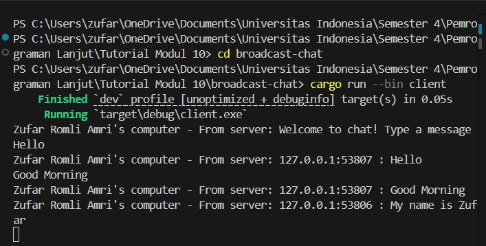

# Reflection Tutorial Modul 10

**Zufar Romli Amri**  
**NPM**: 2306202694  
**Kelas**: A

---

### 2.1 Original code and how to run it.

Gambar 1:

Gambar 2:

Gambar 3:

Gambar 4:

Program yang dijalankan merupakan implementasi sistem chat sederhana menggunakan WebSocket di Rust. Program ini terdiri dari dua bagian utama: server yang menangani koneksi dan menyebarkan pesan antar klien, dan klien yang memungkinkan pengguna untuk mengirim dan menerima pesan.

Ketika program dijalankan sesuai urutan gambar di atas, dan saat kita mengetikkan teks di klien sesuai urutan pada gambar di atas, terjadi beberapa hal berikut:

- Server dimulai dan mendengarkan koneksi pada port 2000 (terlihat pada gambar 1)

- Setiap klien yang terhubung akan menerima pesan sambutan "Welcome to chat! Type a message"

- Ketika pengguna mengetikkan pesan di salah satu klien:

a. Pesan dikirim ke server melalui WebSocket

b. Server menerima pesan dan menyebarkannya ke semua klien yang terhubung (broadcasting)

c. Semua klien, termasuk pengirim, menerima pesan tersebut dengan format "From server: [pesan]"

Pada gambar di atas:

- Klien pertama mengirim pesan "Hello!" (gambar 2)

- Klien kedua mengirim pesan "Good morning!" (gambar 3)

- Klien ketiga mengirim pesan "My name is Zufar!" (gambar 4)

Setiap pesan yang dikirim oleh satu klien diterima oleh semua klien yang terhubung. Ini terlihat dari gambar 2 di mana klien pertama menerima semua pesan, baik yang dikirimnya sendiri maupun yang dikirim oleh klien lain.

Program ini menggunakan fitur konkuren dari Rust dengan bantuan Tokio untuk menangani koneksi secara asinkron. Pada bagian server, fungsi handle_connection menggunakan tokio::select! untuk secara bersamaan menangani pesan masuk dari klien dan menyebarkan pesan ke semua klien yang terhubung melalui saluran broadcast. Sementara pada klien, program juga menggunakan tokio::select! untuk secara bersamaan menangani input dari keyboard dan menerima pesan dari server.
Dengan implementasi ini, sistem chat dapat menangani banyak koneksi secara bersamaan tanpa memblokir proses utama, yang merupakan contoh baik tentang bagaimana asynchronous programming di Rust dapat digunakan untuk membangun aplikasi jaringan yang efisien.

---

### 2.2 Modifying port.

Gambar 1:

Gambar 2:

Untuk memodifikasi port menjadi 8080 dan memastikan program masih berjalan dengan baik, perlu dilakukan perubahan baik di sisi server maupun client. Hal ini karena komunikasi WebSocket melibatkan dua pihak, yaitu client yang membuat koneksi dan server yang menerima koneksi. Dalam kasus ini, port awal pada client.rs adalah 2000 dan diubah ke 8080. Agar koneksi berhasil, kedua sisi harus menggunakan port yang sama.

Perubahan dilakukan di server.rs pada baris yang membangun URI untuk koneksi WebSocket, yaitu: terlampir pada gambar 2.

Di sisi client (server.rs), port sudah menggunakan 8080 seperti terlihat pada gambar 1.

Keduanya menggunakan protokol yang sama, yaitu WebSocket (ws://) yang didefinisikan secara eksplisit di URI yang digunakan pada ClientBuilder di client.rs. Jadi, ya, protokol WebSocket digunakan secara konsisten antara kedua file.

Kesimpulannya, untuk memastikan koneksi berhasil, kita perlu menyamakan port pada client.rs dengan port yang digunakan server.rs, yaitu 8080. Setelah perubahan ini dilakukan dan kode dijalankan kembali, maka koneksi WebSocket seharusnya dapat berhasil terhubung tanpa masalah.

---

### 2.3 Small changes, add IP and Port.

Perubahan yang dilakukan pada client.rs dan server.rs bertujuan untuk menampilkan output yang lebih informatif dan sesuai dengan format yang diinginkan seperti terlihat pada dua gambar hasil eksekusi (client dan server). Perubahan ini bersifat kecil namun sangat penting untuk memperjelas konteks pesan yang diterima maupun dikirim.

Pada client.rs, bagian yang diubah adalah bagian Some(Ok(msg)) => { ... } di mana sebelumnya kemungkinan hanya mencetak pesan secara langsung, kini diperjelas dengan mencetak pesan yang diterima dari server dalam format:

Perubahan ini bertujuan untuk menambahkan identifikasi pengguna di sisi klien sehingga 

saat banyak terminal dijalankan bersamaan, setiap pesan yang muncul bisa diketahui berasal dari sisi siapa. Ini sangat berguna untuk kebutuhan debugging dan simulasi multi-klien saat testing aplikasi chat.

Sedangkan pada server.rs, perubahan juga terjadi di bagian Some(Ok(msg)) => { ... }. Perubahan ini menambahkan pencetakan ke terminal server untuk setiap pesan yang dikirim oleh klien, lengkap dengan alamat IP dan port dari klien tersebut. Selain itu, saat server menyiarkan pesan ke semua klien, format pesan yang dikirim menjadi:

Artinya, setiap klien akan menerima pesan dengan tambahan informasi asal pesan tersebut, yaitu IP dan port pengirim. Tujuannya agar pesan yang diterima oleh klien tidak ambigu dan dapat diketahui siapa pengirimnya. Ini penting dalam aplikasi chat karena pengguna perlu tahu siapa yang mengirim pesan.

Dengan perubahan-perubahan kecil ini, hasil output yang ditampilkan menjadi lebih informatif dan realistis untuk simulasi sistem broadcast-chat berbasis WebSocket, seperti yang ditampilkan dalam kedua gambar hasil eksekusi program (client dan server).

Hasil dari perubahan kedua kode di atas:

Pada sisi server:

Pada sisi client 1:

Pada sisi client 2:

---